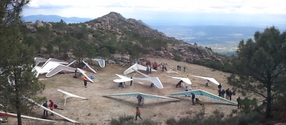

<h2>Reglamento y notas <a href="regulamento.html">Regulamento e notas</a></h2>

En [este enlace](downloads/Reglamento_II_Open_de_Ala_Delta_de_Pedro_Bernardo.pdf "Reglamento del Open de Pedro Bernardo en formato PDF") tenéis a vuestra disposición el [Reglamento del II Open de Pedro Bernardo de Ala Delta](downloads/Reglamento_II_Open_de_Ala_Delta_de_Pedro_Bernardo.pdf "Reglamento del Open de Pedro Bernardo en formato PDF").

* La **cena y entrega de premios** se celebrará el **sábado día 4** en el Mesón Los Arcos, situado junto al ejido donde se fijará el gol dicho día.

* El **domingo día 5** se pondrá **una prueba adicional fuera de competición** (el **Torneo de La Espinita**, en el que aquellos pilotos que hayan quedado por delante de sus amigos tendrán la posibilidad de ofrecerles una última revancha :)
* **Los tres mejores** clasificados **en cada categoría recibirán un trofeo** acompañado de algún regalito de la zona.
* **La responsabilidad y la seguridad de cada piloto corre a cargo del mismo** (cómo cuando vamos a volar normalmente). Para participar será **imprescindible** presentar el correspondiente **seguro de responsabilidad civil** que cubra la actividad de vuelo libre en ala delta.
* **El transporte de alas y la recogida corresponde a los propios participantes**; si necesitáis conductores, desde la organización os los podemos proporcionar con un precio razonable por sus servicios (ver más información en [Alojamiento y conductores](alojamientos.html "Alojamiento y conductores")).
* La cuota de inscripción es de **30 €** que pueden ser abonados al formalizar la inscripción antes del campeonato (ver lugar y horario en el [Reglamento](downloads/Reglamento_II_Open_de_Ala_Delta_de_Pedro_Bernardo.pdf "Reglamento del Open de Pedro Bernardo en formato PDF")), o de forma anticipada (**preferiblemente**) haciendo una transferencia al siguente número de cuenta:



* Si te apetece participar, por favor, mándanos cuanto antes tus datos por medio del [formulario de inscripción](inscripcion.html).
* Para cualquier consulta concreta podéis contactar con la organización del Open:
  * **Armando Cerrada** (director): teléfono **686 136 994**, correo-e **armando@flytietar.com**
  * **Julio López** (juez y coordinador): teléfono **606 824 323**, correo-e **julio@flytietar.com**
* Para cualquier duda o sugerencia de carácter más general podéis utilizar el correo electrónico del foro que hemos habilitado para la prueba [{{site.email}}](https://groups.google.com/group/opendeltietar?hl=es).
